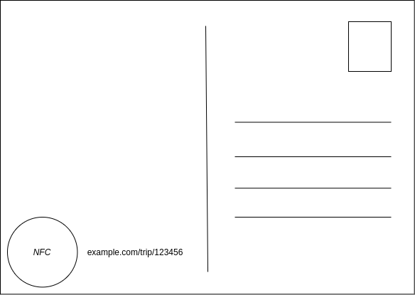
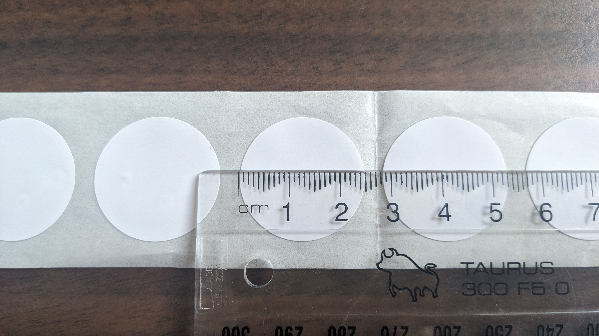

# Card Specification for Museum Scanner with NFC

This specification outlines the requirements for designing a postcard with NFC technology. The postcard should be designed to accommodate both aesthetic appeal and functional elements for interaction through NFC, URL, and optional QR code.

This is a draft specification produced under the assumption we are making postcards.

## Postcard Details

**Size:** A6 (105mm x 148mm)

### Side 1: Aesthetic Design

- This side should be visually appealing.
- Ensure the design does not interfere with the usability and readability of the other side's functional elements.

### Side 2: Functional Design

**Requirements:**

1. **Postcard Layout:**
   - The layout should follow a standard postcard design, including spaces for the address, postage stamp, and a message area.
   - The design must ensure that the postcard remains functional and can still be posted.

2. **NFC Sticker Space:**
   - Include a designated space for a 25mm diameter round NFC sticker.
   - The space should be clearly marked and positioned where it does not interfere with the address or message areas.
   - Stickers will be placed by hand, so any marker should be small enough to be fully concealed to avoid misalignment issues.

3. **URL and ID:**
   - The postcard must contain a URL for accessing the exhibit website.
   - Include a 6-digit numerical ID appended to or positioned underneath the URL.

**If the ID is appended to the URL:**
   - The format should be: `www.example.com/trip/123456` (subject to change)
   - Minimal instructions are needed, such as "Scan NFC or visit URL."

**If the ID is positioned underneath the URL:**
   - The URL should be accompanied by instructions for accessing the website by entering the ID.
   - Example format: 
     - URL: `www.museum-website.com`
     - ID: `123456`
     - Instructions: e.g., "Open the URL and enter the ID to access your trip."

4. **Optional QR Code:**
   - An optional QR code can be included for accessing the website.
   - Position the QR code where it does not interfere with other essential elements.
   - Ensure the QR code is large enough to be easily scanned.

5. **NFC Tag Instructions:**
   - Include instructions indicating that users can scan the NFC tag to open the website with their ID.
   - Example instruction: "Scan the NFC tag to open the website with your ID."

## Notes

- The NFC Sticker is a white 25mm diameter sticker.
- Nathan will arrange printing and application of NFC stickers

